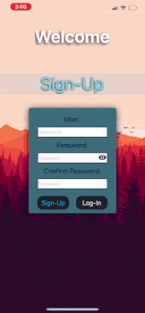
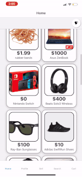
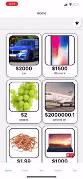
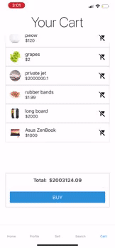
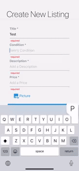

# Eclone - App
[Backend]()

> An ecommerce app that allows users to quickly list and adquired items for sell. Inspired by letgot & ebay.

## Features:
An user is able to:
<ul> 
    <li />browse all featured listings
    <li />post items for sell
    <li />search for a specific item/listing on the app
    <li />track items by favorite system
    <li />checkout/purchase items
</ul>

##### Login & Signup (Screens)
An user is able to Login or Signup for the app

##### Home - Main Listings Page
The user is presented with all avalible listings. Two display options are presented to the user:
<ul>
<li/> overall list - default 
<li/> showcase individual items 
</ul>

##### Item Page
User can get relevant information about a specific item(condition,description,price)

<ul>Avalible interactions
<li/> like/unlike
<li/> add/remote to cart
</ul>

##### User Profile
Display user info, selling items and favorites

##### Search & Checkout
<b>Cart page:</b> shows all items currently in cart, can remove items from cart and purchase items.
<b>Search page:</b> quickly search for specific items

##### Post Listing
An user is able to post items for sell on Eclone. All form fields are required for the listing except picture (optional).

## Technologies

<ul>
<li /><b>React Native (Hooks)</b>
<li /><b>React Native Navigation</b>
<li /><b>React Native Elements</b>
<li /><b>Redux</b>
<li /><b>Thunk</b>
<li />Jbuilder
<li />Active Record
<li />Active Storage
<li />Bcrypt
<li />Ruby on Rails
<li />Postgresql
<li />Cloudinary
<li />Ngrok(development)
</ul>

Notes:
Cloudinary is the media storage management.
Ngrok used to temporally host API through tunneling.

## Meta

Danny Brito – [LinkedIn](https://www.linkedin.com/in/dannybrito) - [Github](https://github.com/DannyBrito)

